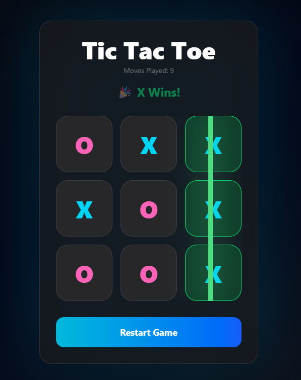

# 🎮 Tic Tac Toe

A modern and responsive Tic Tac Toe game built with **React**, **Vite**, and **Tailwind CSS**.

## ✨ Features

- 🎯 Two-player Tic Tac Toe gameplay
- 🔄 Turn indicator (X / O)
- 🏆 Winner detection
- 🤝 Draw detection
- 🌈 Modern glassmorphism-inspired UI
- 📱 Responsive layout
- 🎨 Color-coded X and O markers
- ⚡ Smooth hover and click animations
- 🔁 Restart game functionality
- 📊 Move counter
- 📈 Winning pattern detection
- ✨ Winning cells highlighting

---

## 📸 Preview

<p align="center">
  
</p>

---

## 🛠️ Tech Stack

- React
- Vite
- Tailwind CSS
- JavaScript

---

## 🚀 Installation

Clone the repository:

```bash
git clone https://github.com/bantiisdas/React-Tic-Tac-Toe.git
```

Navigate to the project:

```bash
cd tic-tac-toe
```

Install dependencies:

```bash
npm install
```

Run development server:

```bash
npm run dev
```

---

## 📂 Project Structure

```text
src/
│
├── App.jsx
├── App.css
├── main.jsx
```

---

## 🧠 Game Logic

### Winning Patterns

The application checks all possible winning combinations:

```javascript
[
  [1, 2, 3],
  [4, 5, 6],
  [7, 8, 9],
  [1, 4, 7],
  [2, 5, 8],
  [3, 6, 9],
  [1, 5, 9],
  [3, 5, 7],
];
```

### Winner Detection

- Tracks occupied positions for X and O
- Compares positions against predefined winning patterns
- Displays winner when a match is found
- Detects draw when all cells are occupied without a winner

---

## 🎨 UI Enhancements

- Gradient background
- Glassmorphism card layout
- Animated interactions
- Responsive board design
- Color-coded player indicators
- Winner banner
- Highlighted winning cells

---

## 📚 React Concepts Used

### Hooks

- `useState`
- `useEffect`

### Array Methods

- `map()`
- `filter()`
- `every()`
- `includes()`

### React Features

- Functional Components
- Props
- Conditional Rendering
- Event Handling
- State Management

---

## 🔮 Future Improvements

- AI opponent
- Scoreboard
- Game history
- Online multiplayer
- Sound effects
- Winning line animation
- Theme switcher

---

## 👨‍💻 Author

Supriya Das

GitHub: https://github.com/bantiisdas
